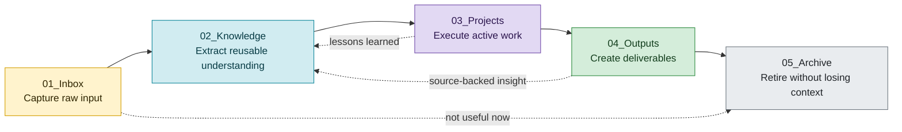
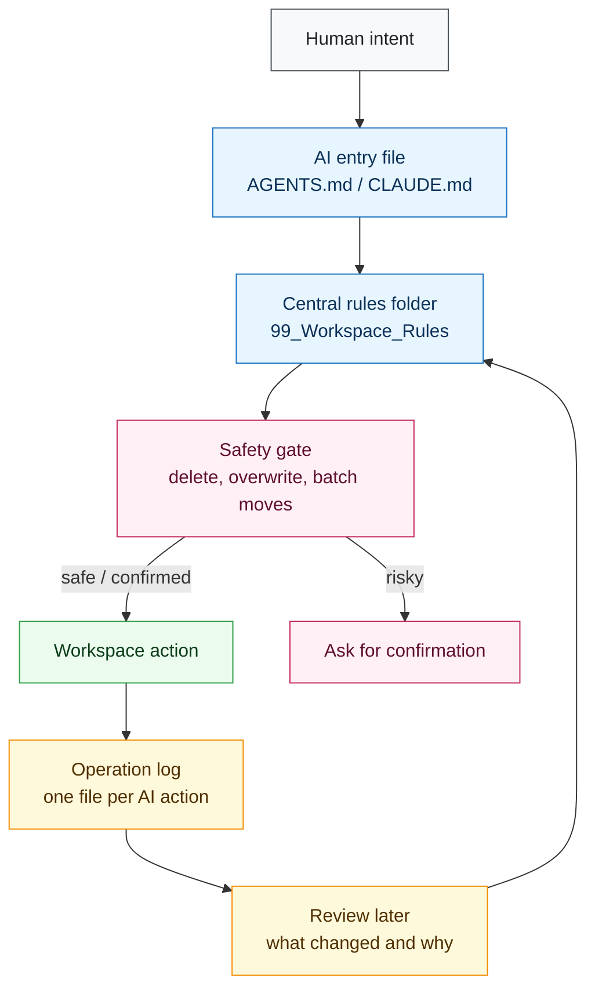
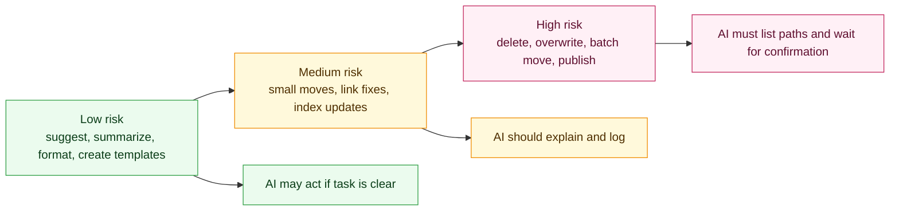

<div align="center">

# AI Workspace Governance

**A lightweight operating system for folders that humans and AI agents manage together.**

Make your workspace agent-ready without letting AI quietly move, rewrite, delete, or forget why it changed things.


</div>

---

## Why This Exists

AI agents are becoming capable file collaborators. They can scan folders, rewrite notes, move files, generate reports, update rules, and maintain long-running projects.

That is useful, but it creates a new problem:

> Once AI can act across a workspace, the workspace needs rules that both humans and AI can follow.

Without governance, AI-assisted folders tend to drift into a familiar mess:

- raw dumps mixed with polished knowledge
- project notes scattered across output folders
- summaries with missing sources
- confident file moves with no migration record
- old material deleted instead of archived
- multiple AI tools reading different instructions

**AI Workspace Governance** turns those risks into a simple, reusable method: structure, routing, safety, review, and audit trails.

## The Method

The method has two loops: a **file lifecycle** and an **AI governance loop**.





## The Five Governance Layers

| Layer | Purpose | Core question |
| --- | --- | --- |
| Structure | Give every folder a job | Where should this file live? |
| Routing | Keep AI instructions consistent | Which rules should the agent read first? |
| Safety | Prevent irreversible mistakes | What needs human confirmation? |
| Review | Let AI inspect before acting | What looks wrong, stale, duplicated, or misplaced? |
| Audit | Make AI work traceable | What changed, why, and under which rules? |

This is the heart of the methodology. The folder names can change; the governance layers should remain.

## Who It Is For

Use it for:

- personal knowledge bases
- Obsidian vaults
- research folders
- writing workspaces
- documentation repositories
- project archives
- team shared folders
- any long-running file workspace touched by AI assistants

It is especially useful when the same workspace contains raw material, reusable knowledge, active projects, outputs, and old material.

## Quick Start

### Option 1: Generic AI workspace

Copy this into your workspace root:

```text
templates/generic-workspace/
```

You will get:

```text
00_System
01_Inbox
02_Knowledge
03_Projects
04_Outputs
05_Archive
99_Workspace_Rules
AGENTS.md
.codex/AGENTS.md
.claude/CLAUDE.md
.agents/AGENTS.md
```

### Option 2: Obsidian vault

Copy this adapter into your vault root:

```text
adapters/obsidian-vault/vault-root/
```

It keeps Obsidian-friendly conventions such as wiki-links, attachments, diary folders, and vault-specific rules.

### Option 3: Minimal install

Only copy the rules folder and one AI entry file:

```text
99_Workspace_Rules/
AGENTS.md
```

Then adapt folder names to your existing workspace.

## First Prompt To Give AI

```text
Please read the workspace governance rules before making changes.

Start with:
- 99_Workspace_Rules/00-README.md
- 99_Workspace_Rules/01-Workspace-Structure.md
- 99_Workspace_Rules/99-Safety-Rules.md

After reading them, summarize the folder responsibilities and safety boundaries.
Do not move, delete, rename, or overwrite files until I confirm a concrete plan.
```

For Obsidian, replace `99_Workspace_Rules` with `99_Vault_Management_Rules`.

## What AI Is Allowed To Do



## Repository Layout

```text
templates/generic-workspace/     Tool-agnostic workspace template
adapters/obsidian-vault/         Obsidian-specific adapter
docs/                            Methodology, prompts, migration guides
.github/                         Issue and pull request templates
```

## Documentation

- `docs/methodology.md`：full methodology
- `docs/quick-start.md`：installation and first use
- `docs/ai-prompts.md`：copy-paste prompts for AI agents
- `docs/migration-checklist.md`：safe migration checklist
- `docs/customization-guide.md`：adapt the system to your domain
- `docs/faq.md`：common questions
- `docs/positioning.md`：project positioning and pitch

## Design Principles

- AI should read rules before touching files.
- Entry files should route; centralized rules should govern.
- Review should come before migration.
- Archive should come before deletion.
- Raw records should not be polished into fake certainty.
- Every meaningful AI operation should leave a trace.
- Public templates should never contain private paths, credentials, or personal notes.

## Contributing

Contributions are welcome. Good contributions make the rules clearer, safer, more portable, or easier for agents to execute.

Please avoid adding personal paths, private notes, credentials, or domain-specific rules that only work for one private workflow.

## License

MIT License.

## Navigation Without Clutter

A governed workspace needs navigation, but navigation should not become a second copy of the folder tree.

This project uses three lightweight navigation patterns:

| Pattern | Purpose | Where it lives |
| --- | --- | --- |
| Home | A short launch page for common actions | `00_System/00-Home.md` or `8-Atlas/00-Home.md` |
| Maps / Atlas | Cross-folder routes and discovery paths | `00_System/10_Maps/` or `8-Atlas/` |
| Guides | Durable local instructions for one folder | `00_Guide/` or `00-Guide/` inside lifecycle folders |

Home starts the day. Maps help you find paths. Guides explain local folder rules. None of them should maintain long manual inventories.
