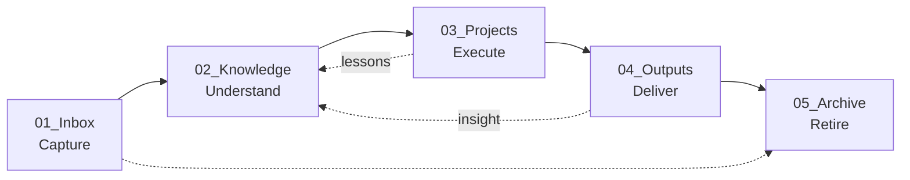

# AI Workspace Governance

A lightweight operating protocol for folders that humans and AI agents manage together.

When AI can change files, your workspace needs rules. This project gives you a practical one: where files go, what agents must read, what requires human confirmation, and how every AI operation is logged.

## The Method in One Diagram



Every file has a job. Every AI action has a gate.

## The Five Layers

| Layer | Purpose | Core question |
| --- | --- | --- |
| Structure | Give every folder a job | Where should this file live? |
| Routing | Keep AI instructions consistent | Which rules should the agent read first? |
| Safety | Prevent irreversible mistakes | What needs human confirmation? |
| Review | Let AI inspect before acting | What looks wrong, stale, or misplaced? |
| Audit | Make AI work traceable | What changed, why, and under which rules? |

Folder names can change; the governance layers should remain.

## Execution Mechanism

Rules do not execute themselves. The method uses session-level triggers:

- **Session start**: read workspace state (inbox backlog, stale projects, last review date)
- **After action**: self-check (links valid? empty dirs? metadata? logged?)
- **Session end**: confirm log written, list unresolved issues, suggest next steps

This turns static rules into a running system.

## Quick Start

### 1. Back up first

If using Git, commit current work. If using cloud sync, make sure sync is stable.

### 2. Copy a template

**Generic workspace:**

```text
templates/generic-workspace/
```

Gives you:

```text
00_System        Navigation (Home, Maps)
01_Inbox         Raw input
02_Knowledge     Reusable understanding
03_Projects      Active work
04_Outputs       Deliverables
05_Archive       Retired material
99_Workspace_Rules  Governance rules
AGENTS.md        AI entry file
```

**Obsidian vault:**

```text
adapters/obsidian-vault/vault-root/
```

Keeps Obsidian-friendly conventions: wiki-links, attachments, diary folders, Atlas navigation.

**Minimal install:** Copy only `99_Workspace_Rules/` and `AGENTS.md`, adapt folder names to your existing workspace.

### 3. First prompt to AI

```text
Please read the workspace governance rules before making changes.

Start with:
- 99_Workspace_Rules/00-README.md
- 99_Workspace_Rules/01-Workspace-Structure.md
- 99_Workspace_Rules/99-Safety-Rules.md

After reading them, summarize the folder responsibilities and safety boundaries.
Do not move, delete, rename, or overwrite files until I confirm a concrete plan.
```

For Obsidian, replace `99_Workspace_Rules` with `99_Vault_Management_Rules`.

### 4. First review

Ask AI for a review-only pass:

```text
Please review this workspace and suggest where files should belong.
Only provide recommendations. Do not move, rename, delete, or overwrite anything.
```

### 5. Small batch migration

After reviewing suggestions, migrate in small batches: one folder, fewer than 10 files, or one obvious category.

### 6. Record operations

AI changes get logged under `99_Workspace_Rules/AI_Operations_Log/` (or `99_Vault_Management_Rules/AI_Operations_Log/` for Obsidian). One log file per operation.

## What AI Is Allowed To Do

| Risk level | Examples | Rule |
| --- | --- | --- |
| Low | Suggest, summarize, format, create templates | AI may act if task is clear |
| Medium | Small moves, link fixes, index updates | AI should explain and log |
| High | Delete, overwrite, batch move, publish | AI must list paths and wait for confirmation |

## Repository Layout

```text
templates/generic-workspace/     Tool-agnostic workspace template
adapters/obsidian-vault/         Obsidian-specific adapter
docs/                            Methodology, prompts, migration guides
```

## Documentation

- `docs/methodology.md` — full methodology, design principles, customization
- `docs/ai-prompts.md` — copy-paste prompts for AI agents
- `docs/migration-checklist.md` — safe migration checklist

## FAQ

**Is this only for Obsidian?**
No. Obsidian is one adapter. The main project is about AI-managed workspaces in general.

**Is this a note-taking method?**
No. It is a governance layer for file workflows.

**Why a centralized rules folder?**
Different AI tools read different entry files. Centralized rules prevent every tool from carrying a slightly different version of the truth.

**Why operation logs?**
AI work should be reviewable. A future human should know what changed, why, and under which rules.

**Can I translate the rules?**
Yes. Keep path examples stable and update AI prompts accordingly.

**Can teams use it?**
Yes, but teams should add ownership, review, permissions, and privacy rules.

## License

MIT License.
